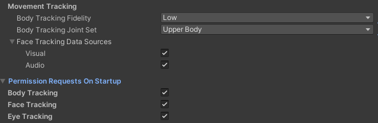
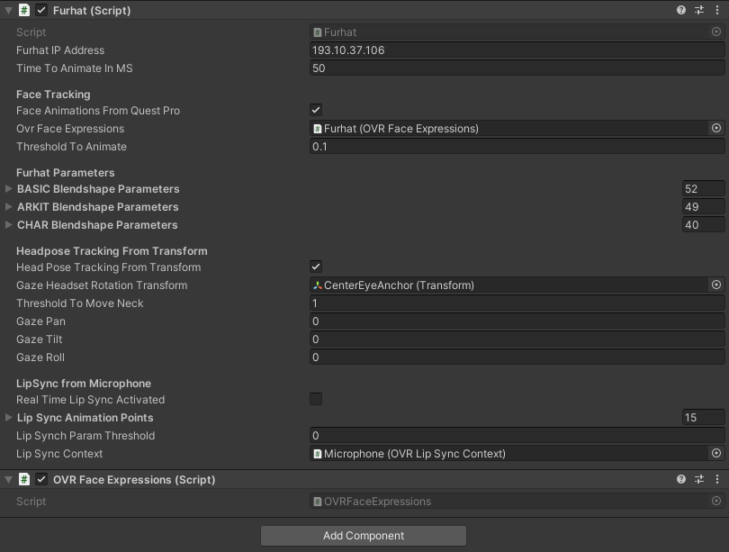

# Furhat Telepresence with a Zed Camera and a Meta Quest Pro
The idea behind this project is to use a [Meta Quest Pro](https://www.meta.com/se/en/quest/quest-pro/) to enable immersing yourself in telepresence with a [Furhat Robot](https://furhatrobotics.com/) that is equipped with a [Zed Mini camera](https://store.stereolabs.com/en-eu/products/zed-mini). That will allow you to interact with participants by using your own voice and the robot will even replicate your facial expressions and gaze and synchronize your speech with them. 


## Get the binaries
If your goal is to have an executable file to telepresence the robot and not further customize development you can simply extract the binary files from binaries.zip and run “Furhat-Telepresence-Quest Pro.exe”. Before running the exe file you will need to install Meta Quest and the Zed Camera software (follow steps 3 and 4a and 4b in the "Replicate the project in Unity" section).

Be aware that there is a FurhatSettings.txt file where you can edit the settings of the robot for the default behavior when the application starts. 

```
localhost - Furhat's Ip Address
true - Lipsync activated (true, false)
40 - number of miliseconds before updating animations in Furhat
0.01 - blendshape threshold to animate furhat
0.1 - Duration of each blendshape change in miliseconds
3 - zed camera resolution (0 = HD2K, 1 = HD1080, 3 = HD720, 5 = VGA)
60 - zed camera framerate
1 - Lipsynch multiplier for PP
0.75 - Lipsynch multiplier for FF
0.75 - Lipsynch multiplier for TH
0.75 - Lipsynch multiplier for DD
0.75 - Lipsynch multiplier for kk
0.75 - Lipsynch multiplier for CH
0.75 - Lipsynch multiplier for SS
0.75 - Lipsynch multiplier for nn
0.95 - Lipsynch multiplier for RR
0.75 - Lipsynch multiplier for aa
0.7 - Lipsynch multiplier for E
0.75 - Lipsynch multiplier for ih
1 - Lipsynch multiplier for oh
0.75 - Lipsynch multiplier for ou
100 - Gaze multiplier Pan
100 - Gaze multiplier Tilt
100 - Gaze multiplier Roll
0 - Gaze calibration/translate Pan
0 - Gaze calibration/translate Tilt
0 - Gaze calibration/translate Roll
false - Blink the same with both eyes
```

### Robot’s IP address

The settings above are starting with localhost as the Furhat’s ip address to enable debugging with virtual Furhat, please change to your robot’s IP address. 

### LipSynch

Speech based Lipsynching, in addition to face tracking, is activated by default with these settings but you can also press “L” on your keyboard at runtime to toggle it on or off.  You can also have a multiplier for each viseme if you want to decrease or increase the expressivity of the viseme animations. You can also press “S” on your keyboard for audio passthrough. This will make it so that the sound from the microphone outputs to the default speaker (which usually is the headset). This sound output is useful as it is synchronized with the Lipsynch animations and can be used for more believable telepresencing. To output it to a different speaker we recommend either disabling the speakers from your oculus device or connecting to your headset’s headphone ports. 

### Animation Properties

You can control the framerate in which the animation commands are sent to Furhat. In the settings file posted above it is at 25 frames per second (every 40 ms). The threshold to animate Furhat is set at 0.01 which means that only when there is a “significant change” in the specific blendshape will it be animated and the duration of each blendshape change is set to 0.1 seconds meaning that it will take 100ms to fully change from the current blendshape value to the target value, providing smooth transitions. 

### Zed Camera Settings

You can change the ZedCamera resolution by setting it to one of the 4 listed options. 2 and 4 are not available in the Zed Mini. You can also set the camera framerate. The recommended settings are either HD1080 with 30 fps or HD720 with 60 fps if you prefer the higher framerate but lower resolution.

### Gaze Multipliers and Callibration

We do not recommend changing these settings

### Blinking Modifier

For a very small subset of users the meta quest pro or the meta movement SDK is not perfect at tracking blinking causing an unwanted behavior of appearing to blink more with one eye than the other. By setting this flag to true you can ensure that both eyes always close the same (the maximum is used for both).

## Replicate the project in Unity

1. Install Unity with the latest LTS version (the last I tried was 2022.3.19f1). 
2. Create a project using the 3D core template
3. Install the [Meta Quest App](https://www.meta.com/en-gb/help/quest/articles/headsets-and-accessories/oculus-link/connect-with-air-link/) to be able to use Meta Quest Link (use a cable connected to the computer instead of the tether less experience)
4. Install the Zed Camera Windows drivers and add the Zed Camera Unity package
    1. Install the CUDA version that corresponds to the Zed Camera SDK (see next step) 
    2. Install the [zed SDK for Windows 11](https://www.stereolabs.com/developers/release) (I installed Zed SDK 4.0 with CUDA 12) 
    3. Add the Unity package corresponding to the latest version of the ZED camera (last I tried was [zed-unity plugin 4.0.7](https://github.com/stereolabs/zed-unity/releases)). From that package, you need the Editor, Prefabs and SDK folders. 
5. Go to Edit→Project Settings→XR Plugin Management and install XR Plugin Management. Accept all recommended project settings. Choose Oculus as the Plug-in provider. 
6. Install the required Meta Packages. You can download them from [here](https://npm.developer.oculus.com/). You can click Window→Package Manager, the + sign on the top left to add a package from Tarball
    1. Add “Meta XR SDK Core” (tested with com.meta.xr.sdk.core-60.0.0). You’ll need to restart Unity. You can also head to Edit→Project Settings→Oculus and fix and apply all recommended settings
    2. Add “Meta XR SDK Interaction OVR” (tested with com.meta.xr.sdk.interaction.ovr-60.0.0)
7. Download Meta Movement SDK from https://github.com/oculus-samples/Unity-Movement/releases (tested with Unity-Movement-4.2.1) and unzip it to a folder on your drive
    1. Install this package by clicking Window→Package Manager, the + sign on the top left but this time to add a package from disk which will look for a package.json file 
8. Download the [Oculus LipSynch Unity plugin](https://developer.oculus.com/downloads/package/oculus-lipsync-unity/) and install it. This time around you should not install it from the package manager but rather from Assets→ Import Package → Custom Package.
9. Delete the original Camera and Drop an OVRCameraRig into your scene (look for it in the project search bar). In the settings inspector check the Use Per Eye Cameras tickbox in OVR Camera Rig and set it to true. 
    
    
    
10. Make sure that Body, Face and Eye tracking are all supported in Quest Features inside the OVRManager script of the OVRCamera Rig. Also make sure to use the following tracking settings.
    
    
    
    
    
    
    
11. Drop a ZED_Rig_Mono in the hierarchy and duplicate the frame inside Camera_left twice. Move the two duplicates inside LeftEyeAnchor and RightEyeAnchor in the OVRCameraRig hierarchy. You can now delete the ZED_Rig_Mono Object. Add the Zed Rendering Plane script to each of the eye anchors and make sure the LeftEyeAnchor and RightEye Anchor reflect these settings:
    
    
    
    
    
12. Include the ZedManager script inside OVRCameraRig, this scripts starts the camera and allows you to manage the ZED camera settings. 
    
    
    
13. Copy the contents from the assets folder to your unity project (Scripts and DLLS folders). Create a Furhat Gameobject inside TrackingSpace and add the Furhat.cs script contained in this github repository to the gameobject. Add an OVR Face Expressions script to Furhat and drag the Furhat game object to the Ovr Face Expressions property. Also, drag the CenterEyeAnchor transform in the hierarchy to Furhat. Currently some of these settings are overriden by the settings file when the application starts. Don’t forget to copy the settings file in github to the main folder of the Unity project (Furhat-Telepresence-Quest Pro). In lip Synch context you should drag the microphone gameobject that will be created in the next step.
    
    
    
14. As a final step, for allowing realtime audio Lipsynch you can should add a Microphone gameobject to Furhat. Then to that object add an Audio Source, OVR Lip Sync Context script and OVR Lip Sync Mic Input script. The microphone gameobject should look like this:
    
    
    
15. You are all done now. Make sure your project hierarchy looks like this: 


## Furhat C# Library
This project uses a compiled version of the [Furhat C# Interface Github Repository](https://github.com/andre-pereira/FurhatCSharpInterface) to control Furhat. As such, you also need the DLLS folder in Assets. However, you can follow the link to the github repository if you need to also make changes to that library.